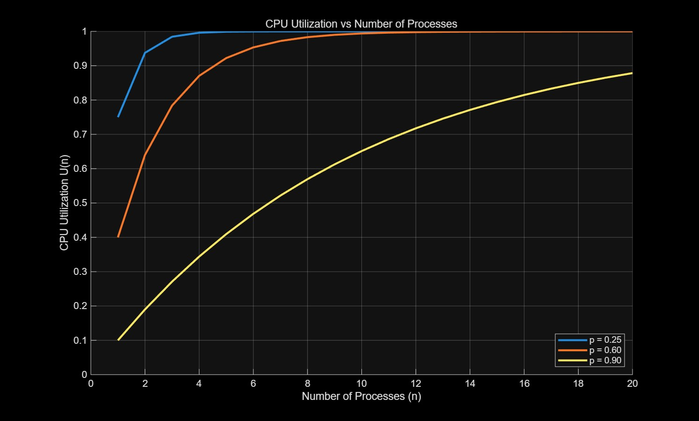

# ECE4820J Homework 2

#### Kaiqi Zhu 522370910091

## Multiprogramming

### Probability & CPU Utilization

The probability of one process waiting = p.

Probability of n processes waiting at the same time = $p^n$.

CPU Utilization: $1 - p^n$

### Curves for CPU Utilization



### Memory

#### Number of Processes

$\frac{256 - 96}{48} = 3.33 \approx 3$ prcesses.

Therefore at most 3 processes can be stored simultaneously in memory.

#### CPU Utilization 

CPU Utilization $= 1 - 0.9 ^ 3 \approx 27.1\%$

#### Comparison of Effects of Adding RAM

1. Add 256 MB $\rightarrow$ total = 512 MB

Number of processes = $\frac{512 - 96}{48} \approx 8$

CPU Utilization $= 1 - (0.9)^8 \approx 57\%$

Improvement: 27% $\rightarrow$ 57%.

2. Add 512 MB $\rightarrow$ total = 768 MB

Number of processes = $\frac{768 - 96}{48} \approx 14$

CPU Utilization $= 1 - (0.9)^14 \approx 77\%$

Improvement: 57% $\rightarrow$ 77%.

3. Add 1024 MB $\rightarrow$ total = 1280 MB

Number of processes = $\frac{1280 - 96}{48} \approx 24$

CPU Utilization $= 1 - (0.9)^24 \approx 92\%$

Improvement: 77% $\rightarrow$ 92%.

Therefore, adding 256MB would be most beneficial and efficient, and worth the investment.

## Understanding system calls
### ```strace``` & ```ltrace```

```strace```: traces system calls (kernel interactions).

```ltrace```: traces library calls (user-space functions from libc or other libraries).

They can be used to debug when a program fails (missing file, wrong syscall, permission denied), understand program behavior for assignments.

### ```manpages``` Sections

- System calls: ```man 2 open```

- Library calls: ```man 3 printf```

### System calls

#### Main types

Process control (fork, execve, wait, exit), file management (open, read, write, close), device management (ioctl),information maintenance (getpid, time), and communication (socket, bind, send, recv, pipe).

#### Run ```strace``` on the ```ls``` Command (```strace ls```)

| System call                     | Type                                | Explanation                                           |
|:---------------------------------:|:------------------------------------:|------------------------------------------------------|
| ```execve("/usr/bin/ls", ...)```| Process control                     | Executes the ```ls``` program.                             |
| ```brk()```                     | Memory management                   | Adjusts program break for heap memory allocation.   |
| ```mmap() / munmap()```         | Memory management                   | Maps files or anonymous memory into the process address space. |
| ```faccessat()```             | File management                     | Checks file existence or access permissions.        |
| ```openat()```                | File management                     | Opens files.                                         |
| ```read()```                  | File management                     | Reads file contents.                                 |
| ```fstat()```                 | File management                     | Gets metadata about a file.                          |
| ```mprotect()```              | Memory management                   | Changes memory page permissions.                     |
| ```set_tid_address()```       | Process control / Thread management | Sets the thread ID for the calling thread.          |
| ```set_robust_list()```       | Process control / Thread management | Sets up robust futex list for threads.              |
| ```rseq()```                  | Process control / Thread management | Registers a restartable sequence for optimization.  |
| ```statfs()```                | File management / System information| Gets filesystem info.                                |
| ```getrandom()```             | Information maintenance             | Generates random numbers.                            |
| ```prlimit64()```             | Information maintenance             | Gets/sets process resource limits.                  |
| ```ioctl()```                 | Device management                   | Queries terminal settings.                           |
| ```getdents64()```            | File management                     | Reads directory entries.                             |
| ```write()```                 | File management                     | Writes output to stdout.                             |
| ```close()```                 | File management                     | Closes file descriptors.                             |
| ```exit_group()```            | Process control                     | Terminates the process.                              |

#### Example Line Explanation

```openat(AT_FDCWD, "/etc/ld.so.cache", O_RDONLY|O_CLOEXEC) = 3```

Explanation:
- ```openat```: Opens a file relative to a directory file descriptor.
- ```AT_FDCWD```: Uses the current working directory as base.
- ```"/etc/ld.so.cache"```: File being opened.
- ```O_RDONLY|O_CLOEXEC```: Open for read only, and FD closes if a new program is executed.
- ```= 3```: Kernel returns file descriptor 3 for this open file.

Meaning: ```ls``` is opening ```/etc/ld.so.cache``` to check cached dynamic libraries needed to run, and the kernel returns a descriptor for subsequent mmap or read.

#### Attaching strace to running process

```strace -p <PID>```

For example, ```sudo strace -p 1```.

Scenario:

A web server process seems to be stuck / unresponsive, and clients cannot get responses. The process is still running (not crashed), but it is not doing useful work.

The debugging tool: ```strace``` is attached to a running process (```strace -p <pid>```) and see system calls it makes. System calls like ```read()```, ```write()```, ```accept()```, ```poll()```, etc. are the main way a server interacts with the OS. By watching what call the process is "blocked" on, why it is not progressing can be known.

Two Common Blocking Points in a Web Server

- Blocked on ```accept()```: The server is probably fine; the issue is no traffic arriving.

- Blocked on ```read()```: Clients are connecting but not completing requests, which may indicate a bad client, DoS pattern, or timeout misconfiguration.