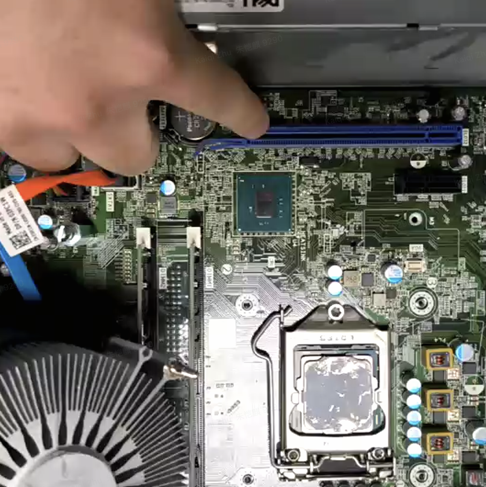

# ECE4820J Lab 1 Report
Kaiqi Zhu 522370910091

## Hardware Overview

Motherboard:


Hard Disk Drive (In this lab we only have SSD, as a substitute of the hard disk drive):


Optical Disk Drive:

Expected to be in a front-facing 5.25-inch drive bay.

PC Power Supply:


PCI Card (Expected Location):



RAM


SATA Socket


PCI Socket


CPU


North and South Bridges

- The North Bridge is expected to be located in the direction towards North in the motherboard.
- The South Bridge is expected to be loacted to the South of PCI bus in the motherboard.

Battery


BIOS

A small square chip expected to be located near the CPU socket or chipset area.

### Questions

1. Where is the CPU hidden, and why?

- CPU is located in a socket under the fan, in the center of the motherboard, in order to ensure efficient communication with other key components, thus improving processing speed. The fan above it is used to cool the CPU.

2. What are the North and South bridges?

- They are two key chipsets on the motherboard that manage data flow between the CPU and other components. Northbridge is the high-speed traffic controller that connects directly to the CPU and managed communication with the fastest components, including the RAM. Southbridge manages the slower peripheral devices, which is connected to the Northbridge and handles communications for things like USB ports, hard drives, and the BIOS.

3. How are the North and South bridges connected together?

- They are connected by an internal bus.

4. What is the BIOS?

- BIOS is Basic Input/Output Systemm, which is a type of firmware stored on a chip on the motherboardm, and the first software to run when the computer is turned on. It is used to initialize and test the hardware, checking whether all the basic components are working correctly, and load the operating system.

5. Take out the CPU, rotate it and try to plug it back in a different position, is that working?

- No. The CPU may be damaged accordingly. CPUs have a specific arrangement of pins on the bottom that must align perfectly with the holes or contacts in the motherboard socket.

6. Explain what overclocking is?

- Overclocking is the practice of increasing a component's clock rate to run at a higher speed than it was designed to operate at from the factory, which are usually done with CPU.

7. What are pins on a PCI/PCI-e card and what are they used for?

- They are the gold-plated contacts along the bottom edge of a PCI or PCI-e card and are used for data transfer, power delivery, and controlling signals.

8. Before PCI-e became a common standard many graphics cards were using Accelerated Graphics Port (AGP), explain why.

- There is because its dedicated bus, direct memory access, and higher bendwidth.

## Command Line Interface

### ```mkdir```, ```touch```, ```mv```, ```cp```, and ```ls``` commands

``` bash
touch test
mkdir dir
mv test test.txt
cp dir/test.txt dir/test_copy.txt
ls
```

### ```grep``` command

``` bash
grep -rl "127.0.0.1" /etc
grep -E 'kevin|root' /etc/passwd
```

### ```find``` command

``` bash
find /etc -atime -1
find /etc -name "*netw*"
```

### Redirection

- ```>``` (Redirect Output): Redirects the standard output (stdout) of a command to a file, overwriting content in the file if it exists.

- ```>>``` (Append Output): Redirects stdout to a file, appending the output to the end of the file without overwriting it.

- ```<<<``` (Here String): Provides a string as stdin to a command.

- ```>&1```: Redirects standard output into standard output.

- ```2>&1```: Redirects stderr to the same location as stdout. This is often used to capture all output (both normal and error messages) in a single file or stream.

- ```tee``` command: Reads from standard input and writes it to both stdout and a file.

### ```xargs``` and ```|```

- ```xargs```: Reads items from stdin and uses them as arguments for another command.
- ```|```: Connects the stdout of the command on its left to the stdin of the command on its right.

### ```head``` and ```tail```

- ```head```: Displays the first part of a file. By default, it shows the first 10 lines.

- ```tail```: Displays the last part of a file. By default, it shows the last 10 lines.

- live display: ```tail -f```

### Monitor the System

- ```ps```: Reports a snapshot of the current processes. It's static. ps aux is a common invocation to see all processes from all users in detail.

- ```top```: Provides a dynamic, real-time view of system processes. It displays a constantly updating list of processes, sorted by CPU usage by default, along with memory and load information.

- ```free```: Displays the amount of free and used physical and swap memory in the system.

- ```vmstat```: Reports virtual memory statistics. It provides information about processes, memory, paging, block I/O, traps, and CPU activity, giving a broad overview of system performance.

### Shell Differences

- ```sh``` (Bourne Shell): The original, classic Unix shell. It is very simple and provides basic job control and scripting. The POSIX standard for shells is based on sh.

- ```bash``` (Bourne-Again Shell): The most common shell on Linux systems. It is a superset of sh, adding many features like command history (using arrow keys), tab completion, better scripting functions, and more.

- ```csh``` (C Shell): Uses a syntax that is more similar to the C programming language. It introduced many interactive features but is generally considered less suitable for scripting than Bourne-style shells due to its more complex syntax for I/O redirection.

- ```zsh``` (Z Shell): A modern, powerful shell that incorporates the best features of multiple kinds of shell, known for its highly advanced and customizable tab completion, spelling correction, and extensive plugin support.

### Shell Variables

```$0```: The name of the script being executed.

```$1, ...```: The positional parameters, representing the arguments passed to a script. ```$1``` is the first argument, ```$2``` is the second, and so on.

```$?```: The exit status of the previous command. A value of 0 indicates success, while any non-zero value indicates an error.

```$!```: The Process ID (PID) of the most recent command executed in the background.

### ```PS3``` Variable

The ```PS3``` variable defines the prompt string used by the select loop construct in shell scripting.

``` bash
#!/bin/bash

PS3="Choose an option: "
options=("List Files" "Go to Parent Directory" "Clear Directory")

select opt in "${options[@]}"; do
    case $opt in
        "List Files")
            ls -l
            ;;
        "Go to Parent Directory")
            cd ..
            ;;
        "Clear Directory")
            rm -rf ./*
            ;;
        *) 
            echo "Invalid option $REPLY"
            ;;
    esac
done
```

### ```iconv``` command

The ```iconv``` command is used to convert text from one character encoding to another, which is useful for interoperability, and  prevents garbled text and ensures compatibility across different platforms and legacy systems.

### Parameter Expansion

```${#temp}```: Length of String. Returns the number of characters in the variable.

```${temp%%word}```: Remove Suffix. Deletes the longest match of word (which can contain wildcards) from the end of the string.

```${temp/pattern/string}```: Substitution. Replaces the first match of pattern with string.

### File System

Files on a Unix-like system are organized in a hierarchical, tree-like structure, starting from a single root directory, denoted by a forward slash (/) and including multiple directories, files, paths, and mount points.

- ```/```: The root directory, the top level of the entire file system.

- ```/bin```: Essential user binaries needed for basic system functionality, available even if /usr is not mounted.

- ```/sbin```: Essential system binaries used for system administration.

- ```/etc```: Configuration files for the host system.

- ```/dev```: Device files that represent hardware components.

- ```/proc```: A virtual filesystem providing information about system processes and kernel status.

- ```/var```: Variable files-files whose content is expected to grow, such as logs, mail spools, and temporary files.

- ```/boot```: Files required for the boot process, including the Linux kernel and initial RAM disk.

- ```/lib```: Essential shared libraries needed by the binaries in /bin and /sbin.

- ```/opt```: Reserved for optional application software packages.

- ```/mnt```: A temporary mount point for manually mounting filesystems.

- ```/media```: Mount points for removable media like USB drives and CD-ROMs.

- ```/srv```: Service data-data for services provided by the system.

- ```/sys```: A modern virtual filesystem that provides information about devices and drivers.

- ```/usr/bin```: Non-essential user binaries (the bulk of user commands).

- ```/usr/lib```: Libraries for the binaries in /usr/bin and /usr/sbin.

- ```/usr/share```: Architecture-independent shared data, like documentation and icons.

- ```/usr/src```: Source code, commonly for the Linux kernel.

- ```/vmlinuz```: The executable file for the Linux kernel. The name comes from "Virtual Memory Linux Zipped."

- ```/initrd.img```: An initial RAM disk image. It's a temporary root filesystem loaded into memory during boot to mount the real root filesystem.

#### Number Guessing Game

``` bash
#!/bin/bash

target=$((RANDOM % 100))

echo "Guess Game Begins!"

while true; do
    read -p "Enter your guess: " guess

    if ! [[ "$guess" =~ ^[0-9]+$ ]]; then
        echo "Please enter a valid number."
        continue
    fi

    if (( guess < target )); then
        echo "Larger"
    elif (( guess > target )); then
        echo "Smaller"
    else
        echo "Congratulations! You have guessed the right number $target!"
        break
    fi
done
```

The bash file can be found in [src/Number_Guessing_Game.sh](./src/Number_Guessing_Game.sh).